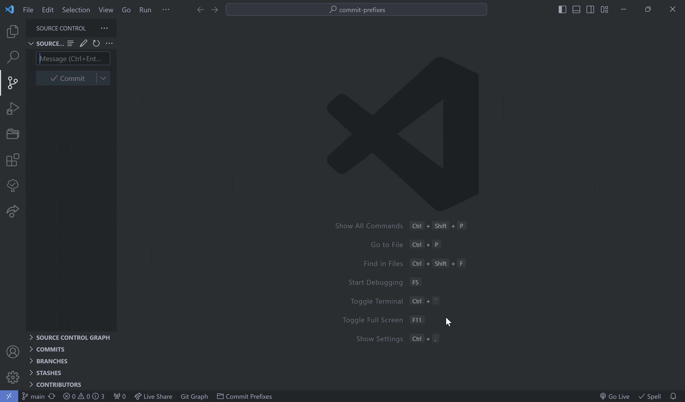
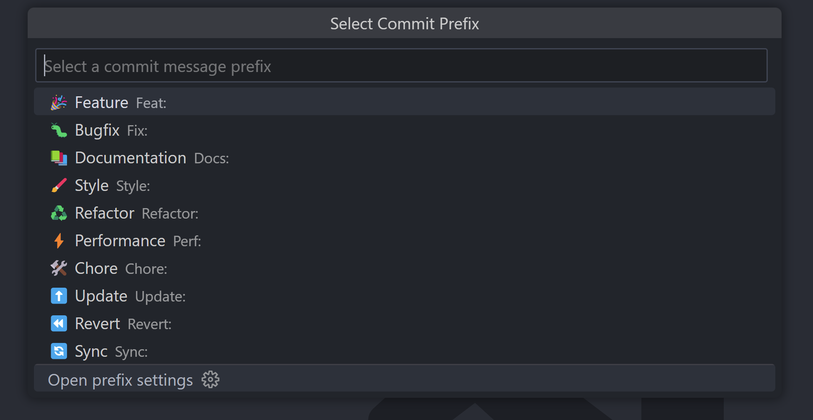

# Speed up Your Commit Prefixes! 🔥

This extension allows you to improve your Git commit workflow by effortlessly adding customizable prefixes & optional emojis to your commit messages, all with the press of a button. It's focus is making your Git workflow faster, easier, and a whole lot more enjoyable.



## Features 🎉

-  **Quickly Pick Your Prefix**: Use the `edit` icon in the Source Control View or the  `Ctrl + Shift + =` shortcut, to quickly select from your list of predefined prefixes and automatically insert them into your commit message.

-  **Automatic Emoji Support**: An optional feature to automatically add the associated emoji into your commit message, appending it at end of your commit messages. ✨

-  **Personal Customization**: Easily edit & add your own set of prefixes, labels, and associated emojis, to cater to your workplace & preferred standardization.

-  **Automatic Prefix Replacement**: Accidentally selected the wrong prefix? Quickly replace it by running the command again & selecting your preferred prefix.



## Settings ⚙️

-  **Label Style**: Select whether you want to your emojis to appear alongside your prefix labels, so that you can easily tell which is which *(on by default).*

-  **Append Emojis**: When turned on, this feature will automatically add the prefix's associated emoji to the end of your commit message *(on by default).*

-  **Hotkey**: By default, the key binding for this extension is set to `Ctrl + Shift + =` however, this can be altered in VSCode's Keyboard Shortcuts page, by searching for the `Fill Commit Message` command *(on by default).*

## Customization 🎨

This extension can easily fit your own workflow! You can fully customize the list of commit prefixes to match your team's style or your own personal preferences. Here's how:

1.  **Open Your User Settings**: Open the `settings.json` file in your editor. This is where you can add or modify your own commit prefixes.

2.  **Locate Prefix Structure**: Once inside the file, look for the `myExtension.commitMessagePrefixes` array. This is the array that stores all of the existing commit prefixes.

3.  **Edit Your Prefix Array**: Each item in the array represents one of your prefix options. Edit or add items to customize these prefixes to your own liking. Each item uses the following structure:

```json
{
	"label": "Feature",
	"prefix": "Feat:",
	"emoji": "🎉",
	"main": true,
	"active": true
},
```

- List of properties:
	- "label": The display name of the prefix.
	- "prefix": The text that will appear at the start of your commit message.
	- "emoji": An emoji that represents the prefix.
	- "main": Determines whether the item appears in the initial quick pick, or requires a search.
	- "active": Determines the prefix's availability.


4.  **Save Your File**: Once all your changes are complete, save the `settings.json` file, and all the updated prefixes will automatically flow through into the extension's command.

That's it! Now you’re all ready to commit with your own custom prefixes and emojis! 🎉

### List of Current Default Prefixes:

- 🎉 Feature | Feat:
- 🐛 Bugfix | Fix:
- 📚 Documentation | Docs:
- 🖌️ Style | Style:
- ♻️ Refactor | Refactor:
- ⚡ Performance | Perf:
- 🧪 Test | Test:
- 🛠️ Chore | Chore:
- 🔍 Debug | Debug:
- ⬆️ Update | Update:
- ⏪ Revert | Revert:
- ♿ Accessibility | A11y:
- 🔄 Sync | Sync:
- 🔥 Hotfix | Hotfix:
- 🔒 Security | Security:
- 🏗️ Build | Build:
- 👷‍♂️ CI | CI:

## Contribution ✍️

Want to play a part in making this extension even better? All contributions are encouraged! Whether you have suggestions for improvements, new features, or bug reports, all sorts are welcome!

Feel free to submit a pull request or open an issue via the [GitHub repository](https://github.com/FinnMidd/commit-prefixes).

Let's make something great together! 🚀

## Acknowledgements 🙏

- Thanks to VSCode & it's community for the excellent [documentation](https://code.visualstudio.com/api/references/vscode-api) and resources.

- Thanks to [Mathias Bynens](https://mathiasbynens.be/), who's [emoji-regex](https://www.npmjs.com/package/emoji-regex) package made the emoji handling a breeze.

- Emoji icons provided by [Emoji Cheat Sheet](https://www.webfx.com/tools/emoji-cheat-sheet/).

## Contact 📬

For questions or support, please open an issue on the [GitHub repository](https://github.com/FinnMidd/commit-prefixes) to get in touch. 📨

## License 📄

This project is licensed under the [MIT License](LICENSE).